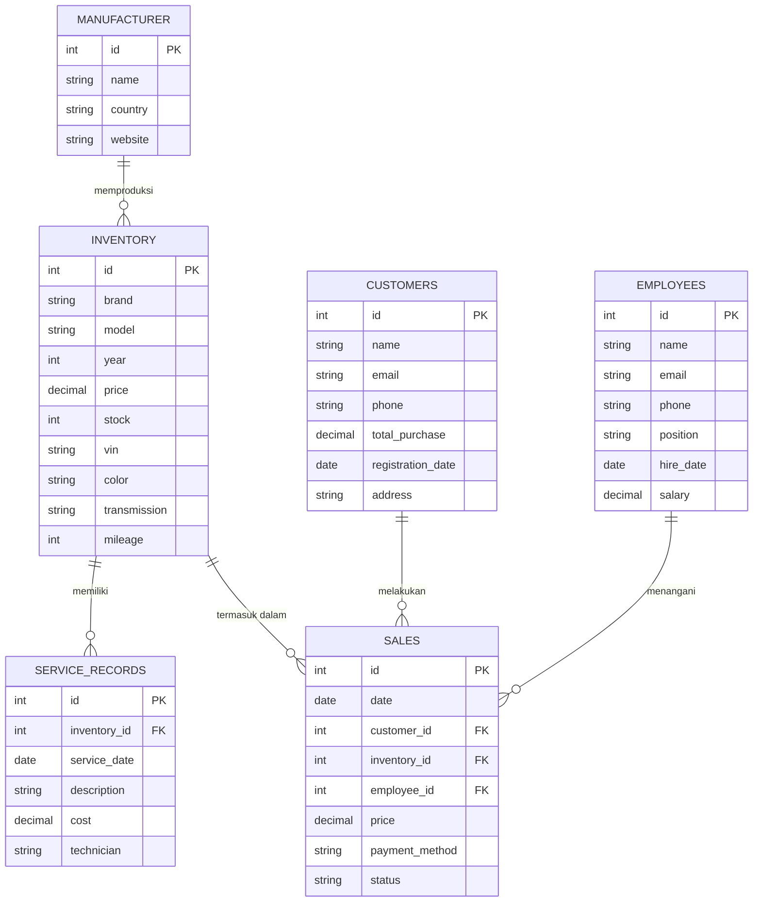

## ERD

```mermaid
erDiagram
INVENTORY ||--o{ SALES : "termasuk dalam"
CUSTOMERS ||--o{ SALES : "melakukan"
EMPLOYEES ||--o{ SALES : "menangani"
MANUFACTURER ||--o{ INVENTORY : "memproduksi"
INVENTORY ||--o{ SERVICE_RECORDS : "memiliki"

    INVENTORY {
        int id PK
        string brand
        string model
        int year
        decimal price
        int stock
        string vin
        string color
        string transmission
        int mileage
    }

    CUSTOMERS {
        int id PK
        string name
        string email
        string phone
        decimal total_purchase
        date registration_date
        string address
    }

    SALES {
        int id PK
        date date
        int customer_id FK
        int inventory_id FK
        int employee_id FK
        decimal price
        string payment_method
        string status
    }

    EMPLOYEES {
        int id PK
        string name
        string email
        string phone
        string position
        date hire_date
        decimal salary
    }

    MANUFACTURER {
        int id PK
        string name
        string country
        string website
    }

    SERVICE_RECORDS {
        int id PK
        int inventory_id FK
        date service_date
        string description
        decimal cost
        string technician
    }
```
